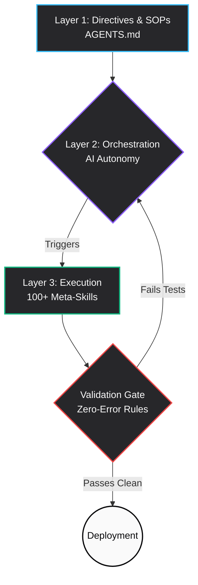

  <h1>⚡ Master-AG: The 3-Layer Automation Matrix</h1>
  
<i>A hyper-optimized, error-proof agentic workspace architecture.</i>

  
  

 

Master-AG is a specialized, high-velocity workspace engineered to safely accelerate autonomous agent workflows. By completely segregating human intent from execution logic, Master-AG natively eliminates AI hallucinations and folder rot.

## 🧠 The Architecture Pipeline

## 🏗️ Core Structural Layers

### 1️⃣ Layer 1: Directives (Intent)
The highest level of control mapped out in `AGENTS.md`. These Natural Language Standard Operating Procedures dictate the macro-behavior loop of the agent.

> [!IMPORTANT]
> **The Strict Validation Gate:** Working as an absolute fail-safe, the layer-1 directives physically lock the agent from handing over code without *first* passing native zero-error tests locally (`npm run build`, `npm run lint`, etc.). No exceptions.

### 2️⃣ Layer 2: Orchestration (Decision-Making)
The cognitive brain. Instead of blindly executing guesses, the LLM reads the directives and routes tasks to the correct specialized skills, creating an intelligent bridge between raw intent and final execution.

### 3️⃣ Layer 3: Execution (Doing The Work)
The deterministic execution engine running entirely out of the `/skills` folder. 
It houses over **100 standardized, modular meta-tools** (ranging from React configuration generators to systemic debuggers), perfectly adhering to fluid `_[name]_skill.md` architecture to prevent workspace clutter.

 

> [!NOTE] 
> **🧲 Self-Healing Structure:** This workspace operates autonomously to prevent logic rot. Any rogue scripts or unparsed AI interactions dropped into the ecosystem are automatically identified, sorted, and renamed by the internal `organize-skills` meta-tool to guarantee absolute structural integrity over time.
