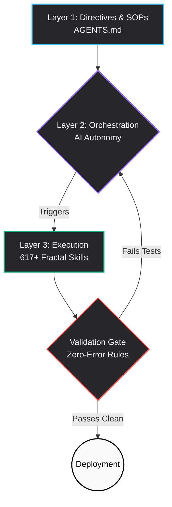

  <h1>⚡ Master-AG: The 3-Layer Automation Matrix</h1>
  
<i>A hyper-optimized, error-proof agentic workspace architecture.</i>

  
  

 

Master-AG is a specialized, high-velocity workspace engineered to safely accelerate autonomous agent workflows. By completely segregating human intent from execution logic, Master-AG natively eliminates AI hallucinations and folder rot. 

This environment is powered by the **Fractal Mastery** logic—ensuring that every task is broken down into progressively more deterministic sub-skills until completion is guaranteed.

## ⌨️ Slash Command Arsenal

Trigger professional workflows instantly using these slash commands. Every command invokes a specific Standard Operating Procedure (SOP).

| Command | Purpose | Action |
| :--- | :--- | :--- |
| `/create` | **Product Engine** | Scaffolds a full feature or project from PRD to Code. |
| `/audit` | **Quality Gate** | Performs a full-spectrum code and architecture review. |
| `/security` | **Hardening** | Scans for vulnerabilities and applies "Security Armor." |
| `/ui-ux` | **Art Director** | Generates premium design systems and advanced visuals. |
| `/debug` | **Surgical Fix** | Root-cause analysis and systemic error remediation. |
| `/performance` | **Optimization** | Vitals audit and bottleneck removal. |
| `/orchestrate` | **Multi-Agent** | Dispatches parallel sub-agents for complex tasks. |

## 🧠 The Architecture Pipeline

```mermaid
graph TD
    classDef directive fill:#27272A,stroke:#38BDF8,stroke-width:2px,color:#FAFAFA;
    classDef orchestration fill:#27272A,stroke:#8b5cf6,stroke-width:2px,color:#FAFAFA;
    classDef execution fill:#27272A,stroke:#10b981,stroke-width:2px,color:#FAFAFA;
    classDef validation fill:#27272A,stroke:#ef4444,stroke-width:2px,color:#FAFAFA;
    classDef deploy fill:#FAFAFA,stroke:#09090B,stroke-width:2px,color:#09090B;

    A[Layer 1: Directives & SOPs<br>AGENTS.md]:::directive --> B
    B{Layer 2: Orchestration<br>AI Autonomy}:::orchestration -->|Triggers| C
    C[Layer 3: Execution<br>617+ Fractal Skills]:::execution --> D
    
    D{Validation Gate<br>Zero-Error Rules}:::validation -->|Fails Tests| B
    D -->|Passes Clean| E((Deployment)):::deploy
```

## 🛠️ Global Component Matrix

Master-AG houses over **617 standardized, modular meta-tools** categorized into 8 core domains for rapid orchestration:

- 🎨 **design**: Art Director logic, Motion Framer, and Theme Factory.
- 🏗️ **planning**: PRD generation, Fractal Roadmap, and Slash Command Workflows.
- 🔍 **review**: Vulnerability Scanner, Security Armor, and Systematic Debugging.
- 📦 **execution**: TDD loops, RAG engineering, Monorepo Architecture, and ML-Ops.
- 🤖 **meta**: Skill Creation, Self-Annealing Loops, and Mastery Registry.
- 📈 **environment**: MCP Builders, OCI ADB Best Practices, and Performance Profiling.
- 🎨 **figma**: Code Connect, Design System Generation, and Library Sync.
- 🛡️ **safety**: Automatic GitHub Snapshots before all major changes.

---

> [!TIP]
> To add a new skill, use `/create skill [name]` and it will automatically be indexed into the global registry.
