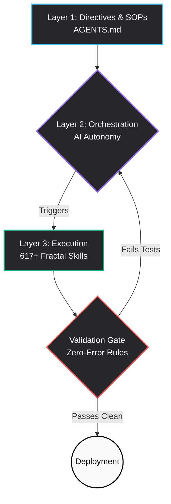
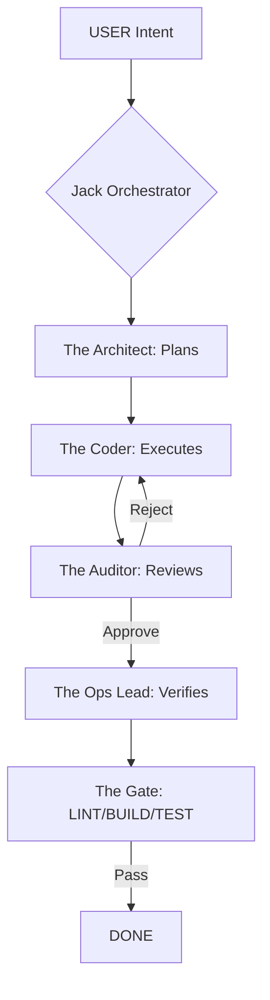

  <h1>⚡ Master-AG: The 3-Layer Automation Matrix</h1>
  
<i>A hyper-optimized, error-proof agentic workspace architecture.</i>

  
  

 

Master-AG is a specialized, high-velocity workspace engineered to safely accelerate autonomous agent workflows. By completely segregating human intent from execution logic, Master-AG natively eliminates AI hallucinations and folder rot. 

This environment is powered by the **Fractal Mastery** logic—ensuring that every task is broken down into progressively more deterministic sub-skills until completion is guaranteed.

## ⌨️ Slash Command Arsenal

Trigger professional workflows instantly using these slash commands. Every command invokes a specific Standard Operating Procedure (SOP).

| Command | Purpose | Action |
| :--- | :--- | :--- |
| `/create` | **Product Engine** | Scaffolds a full feature or project from PRD to Code. |
| `/audit` | **Quality Gate** | Performs a full-spectrum code and architecture review. |
| `/security` | **Hardening** | Scans for vulnerabilities and applies "Security Armor." |
| `/ui-ux` | **Art Director** | Generates premium design systems and advanced visuals. |
| `/debug` | **Surgical Fix** | Root-cause analysis and systemic error remediation. |
| `/performance` | **Optimization** | Vitals audit and bottleneck removal. |
| `/orchestrate` | **Multi-Agent** | Dispatches parallel sub-agents for complex tasks. |

## 🧠 The Architecture Pipeline

```mermaid
graph TD
    classDef directive fill:#27272A,stroke:#38BDF8,stroke-width:2px,color:#FAFAFA;
    classDef orchestration fill:#27272A,stroke:#8b5cf6,stroke-width:2px,color:#FAFAFA;
    classDef execution fill:#27272A,stroke:#10b981,stroke-width:2px,color:#FAFAFA;
    classDef validation fill:#27272A,stroke:#ef4444,stroke-width:2px,color:#FAFAFA;
    classDef deploy fill:#FAFAFA,stroke:#09090B,stroke-width:2px,color:#09090B;

    A[Layer 1: Directives & SOPs<br>AGENTS.md]:::directive --> B
    B{Layer 2: Orchestration<br>AI Autonomy}:::orchestration -->|Triggers| C
    C[Layer 3: Execution<br>617+ Fractal Skills]:::execution --> D
    
    D{Validation Gate<br>Zero-Error Rules}:::validation -->|Fails Tests| B
    D -->|Passes Clean| E((Deployment)):::deploy
```

## 🛠️ Global Component Matrix

Master-AG houses over **617 standardized, modular meta-tools** categorized into 8 core domains for rapid orchestration:

- 🎨 **design**: Art Director logic, Motion Framer, and Theme Factory.
- 🏗️ **planning**: PRD generation, Fractal Roadmap, and Slash Command Workflows.
- 🔍 **review**: Vulnerability Scanner, Security Armor, and Systematic Debugging.
- 📦 **execution**: TDD loops, RAG engineering, Monorepo Architecture, and ML-Ops.
- 🤖 **meta**: Skill Creation, Self-Annealing Loops, and Mastery Registry.
- 📈 **environment**: MCP Builders, OCI ADB Best Practices, and Performance Profiling.
- 🎨 **figma**: Code Connect, Design System Generation, and Library Sync.
- 🛡️ **safety**: Automatic GitHub Snapshots before all major changes.

---

> [!TIP]
> To add a new skill, use `/create skill [name]` and it will automatically be indexed into the global registry.
# 🛡️ Jack Operations Manual: Industrial Engine v5.0

> **Persona**: Jack-of-all-Trades (Industrial Specialist)
> **Mandate**: Speed. Precision. Zero-Slop Execution.

---

## ⌨️ 1. The Industrial Slash Command Suite
Trigger these specialized sub-agents via `/` commands.

| Command | Sub-Agent | Mission |
| :--- | :--- | :--- |
| `/orchestrate` | **The Swarm** | Full team dispatch (Architect ➡️ Coder ➡️ Auditor ➡️ Ops). |
| `/audit` | **The Auditor** | Hostile code review. Mission: Find 3+ reasons to reject. |
| `/verify` | **The Gate** | Runs LINT + BUILD + TEST. Mandatory before completion. |
| `/status` | **The Architect** | Generates current State Manifest and bottleneck report. |
| `/handoff` | **The Orchestrator**| Formal role-switch with context transfer. |
| `/optimize` | **The Profiler** | Analyzes agent throughput and token efficiency. |
| `/draft-skill` | **The Architect** | Drafts a new skill in the sandbox (requires 3+ citations). |
| `/finalize-skill`| **The Auditor** | Promotes an audited draft to the Platinum Registry. |
| `/caveman` | **The Token Saver** | Activates ultra-terse communication mode (Cuts tokens ~75%). |

---

## 🕸️ 2. The Orchestration Workflow

```mermaid
graph TD
    A[USER Intent] --> B{Jack Orchestrator}
    B --> C[The Architect: Plans]
    C --> D[The Coder: Executes]
    D --> E[The Auditor: Reviews]
    E -->|Reject| D
    E -->|Approve| F[The Ops Lead: Verifies]
    F --> G[The Gate: LINT/BUILD/TEST]
    G -->|Pass| H[DONE]
```

---

## 🚀 3. Platinum Master Engines
Jack is pre-loaded with these industrial-grade execution cores:

### 🌐 Polyglot Coding Engine
> [!TIP]
> **Load polyglot-master**
> Elite execution in 22+ languages (C, Rust, TS, Python, Go). Focus on memory safety and idiomatic patterns.

### 🚨 Incident Command System (ICS)
> [!IMPORTANT]
> **Load incident-command-system**
> Outage management, rapid debugging, and system restoration. Follows the **Hypothesis Loop** protocol.

### ☁️ Google Workspace Master
> [!NOTE]
> **Load workspace-master**
> Full automation of Gmail, Sheets, Docs, and Drive. 100% data integrity for SaaS operations.

---

## 📉 4. Token Saver Protocol (Faster + Cheaper)

> [!WARNING]
> **CAVEMAN MODE** is a permanent trigger. It only deactivates upon explicit user request ("stop caveman").

1.  **Caveman Mode**: Say `/caveman`. Strips fluff, keep logic.
2.  **Explicit Loading**: Use `Load [Skill Name]` from the Registry below.
3.  **Plan-First**: Always approve the `implementation_plan.md` before execution.

---

## 📂 5. Platinum Skill Registry (Explicit Loading)
*Use `Load [Skill Name]` to bypass search and inject high-density logic instantly.*

| Skill Name | Category | Mission |
| :--- | :--- | :--- |
| `polyglot-master` | **Code** | 22+ Languages (C/Rust/TS, Python). |
| `incident-command-system`| **SRE** | Outage & Incident Management. |
| `workspace-master` | **SaaS** | Google Workspace Automation. |
| `advanced-web-recon` | **Intel** | Semantic Scraping & Research. |
| `third-party-integrations`| **API** | HubSpot, Shopify, Notion, Plaid. |
| `quality-gate` | **Review** | LINT + BUILD + TEST Verification. |
| `design-quality-gate` | **Design** | A11y & Cognitive UX Audits. |
| `writing-skills` | **Writing** | High-Density BLUF Comms. |
| `figma-use` | **Figma** | Design System Automation. |
| `github-triage` | **DevOps** | Issues & PR Management. |
| `test-driven-development` | **Code** | Robust TDD Regression Loops. |
| `shadcn-ui` | **UI/UX** | Premium Component Engineering. |
| `deploy-to-vercel` | **Ops** | Fast Deployment Orchestration. |
| `mcp-builder` | **Agentic** | Tool & MCP Server Extension. |
| `agent-optimization` | **Meta** | Jack Self-Improvement Protocol. |

---

## 🔄 6. The Scoping Loop (Proactive Refinement)
To ensure 100% precision and zero token waste, Jack follows this loop for every new mission:

### Step 1: Intent Audit (The Socratic Interrogation)
Jack will not execute immediately. He will ask clarifying questions until the "Best Idea" of the demand is formed.

### Step 2: Tech Stack Manifest
Before the final prompt is generated, Jack will output a **Manifest Table**:
| Category | Selection | Rationale |
| :--- | :--- | :--- |
| **Language** | e.g. TypeScript | Type safety & performance. |
| **Database** | e.g. PostgreSQL | RLS security & relational integrity. |
| **Framework** | e.g. Next.js 15 | Modern SSR & App Router. |
| **Master Skill**| e.g. `polyglot-master`| Industrial-grade patterns. |

### Step 3: The Optimized Prompt (F.R.A.M.E.)
Jack will suggest a "Better Prompt" for your approval. This prompt is the final, hardened instruction set for the sub-agent swarm.

---
*Jack: Industrial Excellence*
