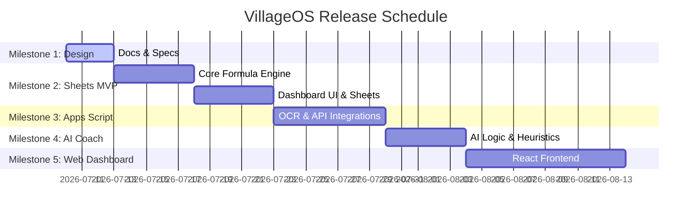

# Project Roadmap - VillageOS

This roadmap outlines the milestones required to design, develop, test, and release VillageOS.

## Development Roadmap

## Milestone Details

### Milestone 1 — Product Design (Current)
*   **Deliverables:** PRD, Architecture documents, and user stories.
*   **Verification:** All requirements peer-reviewed and saved.

### Milestone 2 — Google Sheets MVP
*   **Deliverables:** First release of the functional workbook with basic tables.
*   **Focus:** Production formulas, tribe variables, culture point calculators.

### Milestone 3 — Apps Script Integration
*   **Deliverables:** Google Apps Script backend.
*   **Focus:** API connections for OCR processing and side-bar dashboard logic.

### Milestone 4 — AI Coach & Recommendation
*   **Deliverables:** Recommendation pipeline.
*   **Focus:** LLM prompts parsing sheet metrics and returning building suggestions.

### Milestone 5 — React / Web Dashboard
*   **Deliverables:** Next.js application with Firebase integration.
*   **Focus:** Interactive dashboards and cloud backups of user statistics.
