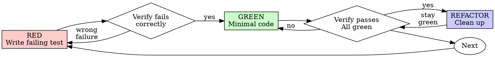

# Test-Driven Development (TDD)

## Overview

Write the test first. Watch it fail. Write minimal code to pass.

**Core principle:** If you didn't watch the test fail, you don't know if it tests the right thing. Tests should verify behavior through public interfaces, not implementation details. Code can change entirely; tests shouldn't.

**Violating the letter of the rules is violating the spirit of the rules.**

## When to Use

**Always:**
- New features
- Bug fixes
- Refactoring
- Behavior changes

**Exceptions (ask the USER):**
- Throwaway prototypes
- Generated code
- Configuration files

## The Iron Law

```
NO PRODUCTION CODE WITHOUT A FAILING TEST FIRST
```

Write code before the test? Delete it. Start over.

**No exceptions:**
- Don't keep it as "reference"
- Don't "adapt" it while writing tests
- Don't look at it
- Delete means delete

## Red-Green-Refactor Loop



### Anti-Pattern: Horizontal Slices
**DO NOT write all tests first, then all implementation.** This is "horizontal slicing" - treating RED as "write all tests" and GREEN as "write all code."

**Correct approach:** Vertical slices via tracer bullets. One test → one implementation → repeat.

```
WRONG (horizontal):
  RED:   test1, test2, test3
  GREEN: impl1, impl2, impl3

RIGHT (vertical):
  RED→GREEN: test1→impl1
  RED→GREEN: test2→impl2
```

### RED - Write Failing Test
Write one minimal tracer bullet showing exactly what should happen end-to-end. Focus on behavior, not implementation mapping.

**Verify RED - Watch It Fail (MANDATORY)**: Confirm it fails because the feature is missing, not due to typos.

### GREEN - Minimal Code
Write simplest code to pass the test. Do not anticipate future tests or design elements.

**Verify GREEN - Watch It Pass (MANDATORY)**: Fix code, not test, until passing perfectly.

### REFACTOR - Clean Up
Look for deep module opportunities (moving complexity behind simple interfaces). Extract duplication. KEEP TESTS GREEN. Never refactor while RED.

## Final Rule
```
Production code → test exists and failed first
Otherwise → not TDD
```
No exceptions without the USER's permission.
